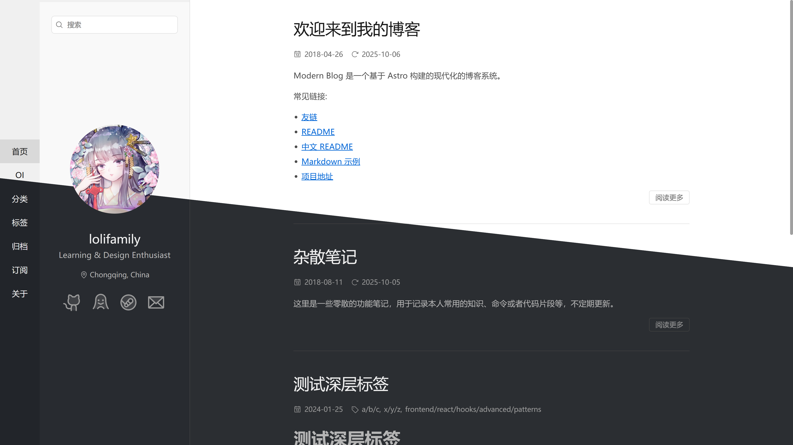

[English Version](./README.md)

# Refined 入门指南

本项目使用 Astro 对优秀主题 [sanonz/hexo-theme-concise](https://github.com/sanonz/hexo-theme-concise) 进行再设计与精炼。致敬原作者，并在保持风格的同时适配 Astro 的内容集合与路由体系。

| 桌面端                          | 移动端                         |
|------------------------------|-----------------------------|
|  |  |


## ⚡ 快速开始

从这里开始，完成最常用的任务：

- 克隆并安装

```sh
git clone https://github.com/loliblogs/Refined
pnpm install
```

- 启动开发服务器

```sh
pnpm dev
```

打开 `http://localhost:3000`。

- 构建并预览

```sh
pnpm build && pnpm preview
```

打开 `http://localhost:4321`。

- 同步类型（当内容集合或 Schema 变更时；dev/build 已会自动生成类型）

```sh
pnpm sync
```

说明：dev/build 已会生成类型；此命令主要用于 CI 或修改 Schema 之后。

更多命令见下表：

| 命令                     | 作用                                  |
|:-----------------------|:------------------------------------|
| `pnpm install`         | 安装依赖                                |
| `pnpm dev`             | 在 `localhost:3000` 启动本地开发服务器        |
| `pnpm dev:full`        | 以完全冷启动（无缓存）启动开发服务器                  |
| `pnpm build`           | 构建生产站点到 `./dist/`                   |
| `pnpm build:full`      | 完整清理构建（忽略缓存）到 `./dist/`              |
| `pnpm sync`            | 同步 Astro 生成的类型                      |
| `pnpm preview`         | 在本地 `localhost:4321` 预览构建产物         |
| `pnpm typecheck`       | 通过 Astro 运行类型检查（包含 `.astro` 文件！）    |
| `pnpm lint`            | 使用 ESLint 检查项目文件                    |
| `pnpm lint:fix`        | 自动修复可修复的 ESLint 问题                  |
| `pnpm astro ...`       | 运行 `astro add`、`astro db` 等 CLI 命令  |
| `pnpm astro -- --help` | 查看 Astro CLI 帮助                     |

**CI 说明：** GitHub Actions 工作流会检测提交标题（首行）中的 `[full]` 并运行 `pnpm build:full` 而非 `pnpm build`。这很少需要——仅用于边界情况，例如 `.md` 与 `.mdx` 之间重命名导致旧缓存引发构建失败时：

```bash
git commit -m "refactor: migrate files from mdx to md [full]"
```

## 🌐 浏览器支持

- Chrome 99+
- Firefox 97+
- Safari 15.4+（iOS 15+）

说明：
- Windows：支持 Windows 7 及以上版本。建议在 Win7 上使用可安装的最新版 Chrome/Firefox。
- Android：Chrome 需 Android 6.0+；Firefox 在 Android 5.0+ 即可。
- **加密文章解密**：需要 Safari 16+（iOS 16+），因为 Argon2 WASM 使用了 SIMD 指令。

## 🚀 项目结构

在你的 Astro 项目中，你会看到以下目录与文件：

```text
/
├── LICENSE
├── astro.config.ts
├── eslint.config.ts
├── ec.config.mjs
├── tsconfig.json
├── package.json
├── pnpm-lock.yaml
├── pnpm-workspace.yaml
├── .env.example
├── .env                  (已 gitignore，从 .env.example 复制)
├── public/
├── db/
│   └── config.ts
└── src/
    ├── content.config.ts
    ├── assets/
    ├── components/
    │   └── pages/
    ├── config/
    │   ├── base.config.tsx
    │   ├── site.config.ts
    │   ├── paths.config.ts
    │   └── comments.config.tsx
    ├── content/
    │   ├── post/
    │   ├── oi/
    │   ├── page/
    │   └── oiPage/
    ├── layouts/
    │   ├── BaseLayout.astro
    │   └── RSSLayout.astro
    ├── pages/
    │   ├── index.astro
    │   ├── [...slug].astro
    │   ├── category/
    │   ├── tag/
    │   ├── oi/
    │   ├── rss.xml.ts
    │   └── rss-styles.xsl.ts
    ├── plugins/
    ├── styles/
    ├── types/
    └── utils/
```

Astro 使用基于文件的路由：`src/pages` 下的任意 `.astro`、`.md`、`.mdx` 或 `.ts` 文件都会根据其文件路径暴露为路由，子目录会映射为嵌套 URL。支持动态与兜底路由，例如 `src/pages/[...slug].astro`，以及分页模式如 `**/[page].astro`。以 `.ts` 文件实现的服务端端点（例如 `src/pages/rss.xml.ts`）需要导出一个返回 `Response` 的处理器，并以动态资源的形式产出。

内容集合（Content Collections）在 `src/content.config.ts` 中通过 `defineCollection` 与 Zod Schema 定义；每个集合对应 `src/content/<collection>` 下的一个文件夹，其中的 Markdown/MDX 条目在开发/构建时会根据前置字段（frontmatter）进行校验。项目会生成强类型以安全访问，并可通过 `pnpm sync` 同步；在页面或组件中使用 `getCollection('post')` 等工具进行内容查询。

内容渲染通过 `src/utils/data-loader.ts` 优化：它在加载时使用 Astro 的 `render()` 为每篇文章预获取 `Content` 组件，页面模板直接使用该组件而非自行调用 `render()`。此外，`src/components/CachedContent.astro` 在构建时缓存渲染后的 HTML，避免同一内容多次出现时（如文章主体与目录）重复渲染。该缓存在 dev 模式下跳过以保证热更新正常。

本项目将 `src/pages` 下的路由保持精简；可复用的页面模板放在 `src/components/pages`；布局外框放在 `src/layouts`；站点级设置集中在 `src/config`；渲染与分类体系（taxonomy）相关的工具位于 `src/utils`。仅将未被代码引用的文件放入 `public`；任何在代码或 Markdown 中可以被导入的均放在 `src`（例如 `src/assets`）下，并会被压缩与打包。在 Markdown/MDX 中，图片可通过相对路径或导入引用；任何可由 import 解析的别名都生效，包括映射到 `src` 的 `@/`（在 `tsconfig.json` 中配置）。

## 📝 Frontmatter

内容 frontmatter 由 `src/content.config.ts` 校验。集合 `post` 与 `oi` 共享同一套 Schema（标题、日期、分类/标签与元信息），而 `page` 与 `oiPage` 仅要求最少字段，如 `title` 与可选日期。下面的示例展示一个典型 Markdown 条目，并在行内注释中解释各字段。分类与标签同时支持单数/复数键名，且支持多层级值：使用类似路径的 `/` 表达层级。

```md
---
title: 构建一个高速的 Astro 博客
description: 可选，用于 SEO 摘要。
excerpt: 可选，用于列表的简短预告。
date: 2025-03-10
updated: 2025-09-15

# 你可以使用 `category` 或 `categories`。支持多个值。
# 层级用斜杠表示，且可混合多条层级路径。
categories:
  - 前端/React
  - DevOps/Kubernetes

# 你可以使用 `tags` 或 `tag`。支持多个与层级标签。
tags:
  - javascript
  - react/hooks
  - kubernetes/networking

# 分类/标签名称会自动标准化用于显示：
#   - 已有大写字母 → 保持原样（FFmpeg、JavaScript）
#   - 小写品牌词 → 保持原样（npm、pnpm、npm-cli）
#   - 其他全小写 → 首字母大写（frontend → Frontend）
# URL 始终为小写，与显示名称无关。
# 品牌词列表：以 "npm" 或 "pnpm" 开头的字符串。

# 草稿在生产环境会被渲染，但不会进入索引/列表（如首页、归档）。
draft: false

# sticky 为可选项，省略时默认为 0。数值越大越靠前；负数表示置底。
sticky: 10

# 可选作者覆盖；若省略则回退到站点默认作者。
author: Jane Doe

# 若站点已配置评论系统，此项可开启评论。
comments: true

## 加密相关字段在后文有单独说明。
---

用于索引页的预告段落。

注意：下面的 read-more 标记仅在未设置 frontmatter 中的 excerpt 时，才会影响首页摘要。

::more

剩余内容……
```

摘要与预览规则：

- description：可选，用于 SEO 摘要；若省略会从正文自动生成。
- excerpt：若存在，所有列表页（首页/标签/分类）都优先使用它。若同时存在 `excerpt` 与 read-more 标记，以 excerpt 为准（忽略标记）。若不存在 excerpt：首页从正文渲染（若存在 read-more 标记，则截断到第一个标记之前；否则渲染全文）；标签/分类页不显示正文预览。若文中存在多个 read-more 标记，仅识别第一个。

Read-more 标记（使用以下其中一种）：

```md
::more
```

推荐语法，在 `.md` 和 `.mdx` 文件中均可使用。

```html
<!--more-->
```

旧语法，仅在 `.md` 文件中有效；由于 MDX 解析机制，在 `.mdx` 中不支持。

关于本项目支持的完整 Markdown 语法与特性，请查看在线示例：[Markdown 语法指南](https://blog.lolifamily.js.org/post/markdown-example)

以上 frontmatter 与 `src/content.config.ts` 中的 Zod Schema 一一对应。日期会被强制转换为 `Date`。分类与标签既可为单个字符串，也可为数组；在处理过程中会归一化为数组，每个字符串都可表示多级路径（例如 `前端/React`）。显示名称会自动首字母大写（如 `frontend` 变为 `Frontend`），除非已包含大写字母或属于公认品牌词（如 `npm`、`pnpm`）；URL 始终生成为小写以避免产生重复分类。草稿在生产环境仍会渲染，但不会出现在首页、归档等索引型页面。`sticky` 为可选（默认 0），用于控制置顶与列表排序：数值越大越靠前；负数则显式置底。

## 🧩 MDX（Markdown + JSX）

MDX 允许你在同一文件中编写 Markdown 与 JSX。项目通过 `@astrojs/mdx` 启用（见 `astro.config.ts`）。速览：

- 在 `src/content/**` 的内容集合中，MDX 与 Markdown 同时受支持。通常你可以把现有 `.md` 文件直接重命名为 `.mdx` 并几乎不需改动；沿用相同的 frontmatter Schema 与生成的类型。
- MDX 走与 Markdown 相同的 remark/rehype 流水线，包含数学公式与 Shiki 代码高亮。关于数学公式详见 MathJax 小节。
- 你可以在 MDX 中导入并渲染 `.astro` 或 `.tsx` 组件。需要交互时，遵循 Astro 标准的客户端指令。

示例：

````mdx
---
title: 使用 MDX
---

export const date = '2025-09-18' // 等价 frontmatter；可在下方 {} 中参与运算
export const tags = ['mdx', 'tips'] // 等价 frontmatter；也可用于计算

import MediumZoom from '@/components/MediumZoom.tsx'

# 你好 MDX

发布于 {new Date(date).toLocaleDateString()}

标签: {tags.join(', ')}

<MediumZoom />

```js
console.log('代码块会被语法高亮');
```
````

了解更多：

- Astro 指南：[MDX 集成](https://docs.astro.build/en/guides/integrations-guide/mdx/)
- MDX 官方文档：[mdxjs.com/docs](https://mdxjs.com/docs/)

## 🔗 跨文章链接

使用 `:postlink` 指令在文章之间创建链接。这是一个 remark 指令（而非 MDX 组件），因此在 `.md` 和 `.mdx` 文件中均可使用，无需导入 JSX。

```md
详情请参阅 :postlink[我的另一篇文章]{id="oi/example-post.md"}。

带锚点的链接：:postlink[章节链接]{id="post/guide.md" anchor="setup"}
```

`id` 属性使用 `<集合>/<文件名>` 格式，文件名需包含扩展名。

底层实现原理：

1. **构建时 slug 映射**（`src/plugins/postlink-integration.ts`）：一个 Astro 集成在 `astro:config:setup` 钩子（任何内容处理之前）运行。它扫描 `src/content` 下的所有 `.md/.mdx` 文件，使用 `gray-matter` 解析 frontmatter，通过 `github-slugger` 计算 slug（或使用 frontmatter 中的自定义 `slug`），并构建查找表：`{ "oi/article.md": "/oi/post/article", ... }`。该映射作为模块级变量导出。

2. **指令转换**（`src/plugins/remark-directive-rehype.ts`）：在 Markdown 处理期间，remark 插件拦截 `:postlink` 指令，从预构建的映射中查找 URL，并将节点转换为 `<a href="...">` 元素。若 id 未找到，则渲染为警告提示。

为什么使用指令而非 MDX 组件？MDX 会将所有内容编译为 JSX AST，即使是纯 Markdown 文件也是如此，这会很慢。使用 remark 指令，纯 `.md` 文件保持快速（无需 JSX 编译），且同一语法在两种格式中通用。这一方案将 MDX 转换时间从每个文件约 2600ms 降至约 50ms。

## ⚙ 配置

从 `astro.config.ts` 开始。将 `site` 设置为你的站点规范 URL。本项目已支持非根 base（例如 `base: '/blog/'`）。集合 URL 路径在 `src/config/paths.config.ts` 中定义。

主要配置位于 `src/config/base.config.tsx`（含 JSX 组件的原始配置）与 `src/config/site.config.ts`（处理 MathJax 的入口）。它为每个集合（例如 `post` 与 `oi`）提供设置，包括站点标识（标题、副标题、描述）、导航菜单、分页、全局评论开关、favicon 链接，以及对加密内容的默认提示文案。该文件内注释非常详尽——先快速浏览顶部关键选项，完整参数请参考内联注释。

集合 URL 路径集中在 `src/config/paths.config.ts`。该文件定义 `COLLECTION_PATHS`（将集合映射到其 URL 段，如 `post` → `'post'`、`oi` → `'oi/post'`）和 `BASE_PATHS`（集合根路径）。添加新集合或更改 URL 结构时修改此文件。路径配置被有意与站点配置分离，是因为 Astro 集成（如 postlink slug 映射器）需要在构建时导入路径定义，而不能引入主站配置中的 SolidJS/JSX 依赖。

评论系统通过 `src/config/comments.config.tsx` 接入。尽管文件名叫 config，它实际上是一个组件入口：你可以将其替换为任意评论提供方（Giscus、Disqus、Gitalk，或自定义组件）。文章页会渲染它，并遵循站点配置中的 `comments` 开关。如果替换提供方，请保持默认导出为一个 SolidJS 组件。

## 🔐 加密

加密文章使用由密码派生的密钥保护渲染后的 HTML。服务端从每篇文章的密码与唯一盐值通过 Argon2id（内存 64MB、时间 3、并行度 1）派生 32 字节密钥，然后采用 AES‑256‑GCM 与随机 12 字节随机数（nonce）进行加密。加密后的负载以 JSON 形式输出，包含盐值、随机数与携带认证标签的密文。客户端通过一个轻量 Web Worker 使用同样的口令与盐值派生密钥，并借助浏览器 WebCrypto API 在本地进行认证解密。

实现分布于：服务端加密 `src/utils/encrypt-processor.ts` 与 `src/components/EncryptWrapper.astro`；客户端派生与解密 `src/utils/argon2-worker.ts` 与 `src/components/DecryptClient.tsx`；服务端密钥派生与缓存 `src/utils/argon2-cache.ts`；以及在 Astro DB 中用于存储加密后的派生密钥与元数据的表 `db/config.ts`。文章页在 `src/components/pages/PostPage.astro` 中整合这些模块。

要将某篇文章标记为受保护，请在 frontmatter 中设置加密相关字段。注意，密码本身不会存储在内容中；改由机密（secrets）在构建或运行时提供。

```md
---
title: 加密示例
date: 2025-09-15
encrypted: true
# 可选的 UI 文案；两者都是可选项，未设置则回退到
# src/config/base.config.tsx 中配置的站点默认值
prompt: 该内容已受保护，请输入密码以查看。
hint: 你收到的私密密码。
---

正文内容在构建时会被加密，客户端收到的是密文。
```

服务端机密通过 `getSecret()` 读取，需通过环境变量提供。首次安装时，`postinstall` 脚本会在缺失 `.env` 的情况下尝试将 `.env.example` 复制为 `.env`；若未成功，请手动复制。本地仅加载 `.env`。请定义 `SECRET_PASSWORDS`、`SECRET_ENCRYPTION_PASSWORD` 与 `SECRET_ENCRYPTION_SALT`。其中 `SECRET_PASSWORDS` 为一个 JSON 对象，将 `<collection>:<entry id>` 映射到用于派生每篇文章密钥的明文密码；entry id 含集合目录下的文件扩展名（例如 `src/content/post/encrypted-test.mdx` 对应 id `encrypted-test.mdx`）。`SECRET_ENCRYPTION_PASSWORD` 与 `SECRET_ENCRYPTION_SALT` 用于通过 HKDF 派生用于静态加密（AES‑GCM）的密钥，以加密 Astro DB 缓存中的派生密钥。

```dotenv
# 将内容条目映射到其密码。键格式为 "<collection>:<entry id>"。
# 示例：
#   post:encrypted-test.mdx   → src/content/post/encrypted-test.mdx
#   oi:binary-search.md       → src/content/oi/binary-search.md
SECRET_PASSWORDS='{"post:encrypted-test.mdx":"change-me","oi:binary-search.md":"change-me-too"}'

# 纵深防御：派生 AES-GCM 密钥用于加密缓存的密钥。
# 缓存数据库已有文件级加密；这是额外的一层防护。
SECRET_ENCRYPTION_PASSWORD='please-generate-a-strong-random-string'
SECRET_ENCRYPTION_SALT='another-strong-random-string-or-base64'
```

本地开发时，将上述变量置于 `.env`（`.env.example` 仅为模板，不会被加载）。在 Cloudflare Pages 上，请以相同名称配置项目机密（例如使用 `wrangler pages secret put SECRET_PASSWORDS`，另外两个同理）。密钥与密码不会发送至浏览器；仅加密后的有效载荷会下发，且解密在客户端由用户输入的密码完成。

Argon2 缓存只是一个构建期优化——丢失它仅意味着重新计算密钥（几秒钟的 CPU 时间），不会有数据丢失。缓存使用本地 SQLite 文件（`file:.cache/persist.db`），通过数据库 URL 中的 `encryptionKey` 实现文件级加密。额外的 AES-GCM 层（由 `SECRET_ENCRYPTION_PASSWORD` 与 `SECRET_ENCRYPTION_SALT` 派生）是一种保守的纵深防御措施；实际上文件级加密已足够保护静态缓存数据。不要为此缓存配置真正的远程数据库——延迟和网络可靠性会使其失去意义。

## 🧮 MathJax

数学渲染分两层进行。对于 Markdown/MDX 内容，数学公式在 remark/rehype 阶段被解析并通过 `src/plugins` 中的自定义流水线转换为静态 HTML。`remark-math.ts` 插件与官方行为一致并做了一个小扩展：当一段单行内联公式被足够多的 `$` 定界符包裹（可通过 `flowSingleLineMinDelimiter` 配置）时，会被提升为展示模式，并在生成节点上设置 `math-display` 类名。`rehype-mathjax.ts` 在外部行为与上游保持一致，但改为基于 MathJax v4 实现；它将数学内容（包括围栏 \`\`\`math 代码块）转换为 HTML，注入生成的样式表但不包含字体 URL，并将字体的 @font-face CSS 下放到 `src/styles/mathjax.css`（由 `src/styles/global.css` 引入）以便打包。

对于导航与侧边栏等 UI 外框，标题、菜单标签中也可能出现数学公式。这些在构建时由 `src/utils/mathjax-processor.ts`（在 `src/config/site.config.ts` 中调用）处理。每个集合使用独立的处理器实例以确保 CSS 隔离，并应用与内容流水线一致的字体 CSS 清理，使 UI 外框与内容的渲染一致。

## 👀 想了解更多？

查阅 [Astro 文档](https://docs.astro.build) 或加入 [Astro Discord](https://astro.build/chat)。针对本项目，请在 [Issues](https://github.com/loliblogs/Refined/issues) 中报告可复现的 bug、回归与范围明确的特性请求；在 [Discussions](https://github.com/loliblogs/Refined/discussions) 中提问、寻求使用帮助、讨论想法、设计提案与一般性反馈——这样可以让 issue 列表保持聚焦与可执行。

这是一个个人项目。这里的“个人”意味着优先满足作者自身使用的“够用”，而非通用主题。为保持代码体量小、可读、易维护，以下请求会被有意排除在范围之外：

- 不提供 i18n 或多语言路由。站点硬编码为 `zh-CN`。
- 不提供 MathJax 的功能开关；公式流水线是内置的。若需禁用请自行修改代码。
- 不提供插件系统、主题预设矩阵或面面俱到的开关；默认值是有主观取舍的。
- 不提供多集合管理的脚手架/界面；集合的定义、添加与移除均遵循相同的基于 Schema 的手动过程，且不在范围内。
- 会显著增加复杂度且对日常价值不明确的“过度工程化”修改大概率会被拒绝。

说明：以上条目为示例性而非穷举；范围包括——但不限于——这里列出的内容。

欢迎 bug 修复与小而聚焦的改进。对于较大的改动，请先开一个 Discussion 以确认方向契合度。若提案因项目理念或范围被拒，作者可能（视情况）提供相关文件/模块指引、高层方向或建议性编辑，帮助你自行实现；这是一种尽力而为的帮助而非义务。若当前方向无法满足你的需求，欢迎在 LICENSE 许可下 fork。


