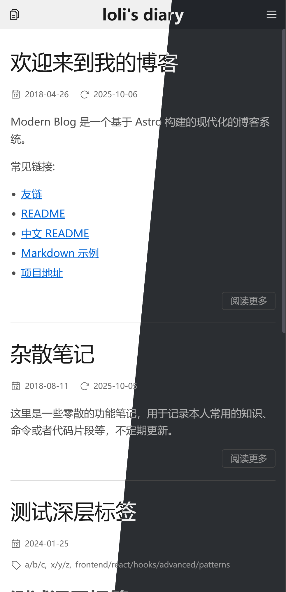

[中文 README](./README-zh.md)

# Refined Starter Guide

This project refines and re-implements the excellent [sanonz/hexo-theme-concise](https://github.com/sanonz/hexo-theme-concise) with Astro. Credit to the original theme; ideas, structure and styles are adapted for Astro's content collections and routing.

| Desktop                          | Mobile                         |
|----------------------------------|--------------------------------|
|  |  |


## ⚡ Quick Start

Start here with the most common tasks:

- Clone and install

```sh
git clone https://github.com/loliblogs/Refined
pnpm install
```

- Start the dev server

```sh
pnpm dev
```

Open `http://localhost:3000`.

- Build and preview

```sh
pnpm build && pnpm preview
```

Open `http://localhost:4321`.

- Sync types (when content collections or schemas change; dev/build run type generation automatically)

```sh
pnpm sync
```

Note: dev/build already generate types; this is mainly for CI or after schema changes.

More commands are listed in the table below.

| Command                | Action                                                      |
|:-----------------------|:------------------------------------------------------------|
| `pnpm install`         | Installs dependencies                                       |
| `pnpm dev`             | Starts local dev server at `localhost:3000`                 |
| `pnpm dev:full`        | Starts dev server with a full cold start (no cache)         |
| `pnpm build`           | Build your production site to `./dist/`                     |
| `pnpm build:full`      | Full clean build (ignores cache) to `./dist/`               |
| `pnpm sync`            | Synchronize Astro-generated types                           |
| `pnpm preview`         | Preview your build locally at `localhost:4321`              |
| `pnpm typecheck`       | Run type checks via Astro (Including .astro files!)         |
| `pnpm lint`            | Lint project files with ESLint                              |
| `pnpm lint:fix`        | Automatically fix fixable ESLint issues                     |
| `pnpm astro ...`       | Run CLI commands like `astro add`, `astro db`               |
| `pnpm astro -- --help` | Get help using the Astro CLI                                |

**CI note:** The GitHub Actions workflow detects `[full]` in the commit title (first line) and runs `pnpm build:full` instead of `pnpm build`. This is rarely needed—only for edge cases like renaming files between `.md` and `.mdx` where stale cache causes build failures:

```bash
git commit -m "refactor: migrate files from mdx to md [full]"
```

## 🌐 Browser Support

- Chrome 99+
- Firefox 97+
- Safari 15+ (iOS 15+)

Notes:
- Windows: Works on Windows 7 and newer. Use the latest Chrome/Firefox available for Win7.
- Android: Chrome requires Android 6.0+; Firefox works on Android 5.0+.

## 🚀 Project Structure

Inside your Astro project, you'll see the following folders and files:

```text
/
├── LICENSE
├── astro.config.ts
├── eslint.config.ts
├── ec.config.mjs
├── tsconfig.json
├── pagefind.yaml
├── package.json
├── pnpm-lock.yaml
├── pnpm-workspace.yaml
├── public/
├── db/
│   └── config.ts
└── src/
    ├── content.config.ts
    ├── env.d.ts
    ├── assets/
    ├── components/
    │   └── pages/
    ├── config/
    │   ├── site.config.tsx
    │   ├── paths.config.ts
    │   └── comments.config.tsx
    ├── content/
    │   ├── post/
    │   ├── oi/
    │   ├── page/
    │   └── oiPage/
    ├── layouts/
    │   ├── BaseLayout.astro
    │   └── RSSLayout.astro
    ├── pages/
    │   ├── index.astro
    │   ├── [...slug].astro
    │   ├── category/
    │   ├── tag/
    │   ├── oi/
    │   ├── rss.xml.ts
    │   └── rss-styles.xsl.ts
    ├── plugins/
    ├── styles/
    ├── types/
    └── utils/
```

Astro uses file-based routing: any .astro, .md, .mdx, or .ts file under `src/pages` is exposed as a route based on its file path, and nested directories become nested URLs. Dynamic and catch-all routes such as `src/pages/[...slug].astro` and pagination patterns like `**/[page].astro` are supported. Server endpoints implemented as `.ts` files (for example `src/pages/rss.xml.ts`) export a handler returning a `Response` and are emitted as dynamic assets.

Content Collections are defined in `src/content.config.ts` via `defineCollection` and Zod schemas; each collection maps to a folder under `src/content/<collection>` where Markdown/MDX entries provide frontmatter validated at dev/build time. Strong types are generated for safe access and can be synchronized with `pnpm sync`, and content is queried with utilities like `getCollection('post')` in pages and components.

This project keeps routes thin in `src/pages`, implements reusable page templates under `src/components/pages`, shares layout chrome in `src/layouts`, centralizes site settings in `src/config`, and places rendering and taxonomy helpers in `src/utils`. Put only unreferenced files in `public`; any asset imported from code or Markdown (including images) can live under `src` (for example `src/assets`) and will be compressed and bundled. In Markdown/MDX, images can be referenced via relative paths or imports; any import-resolvable alias works, including `@/` which maps to `src` (configured in `tsconfig.json`).

## 📝 Frontmatter

Content frontmatter is validated by `src/content.config.ts`. Collections `post` and `oi` share the same schema (title, dates, categories/tags and meta), while `page` and `oiPage` only require minimal fields like `title` and optional dates. The example below shows a typical Markdown entry with inline comments explaining each field. Both singular and plural keys are accepted for categories and tags, and multiple hierarchical values are supported by using `/` in a path-like notation.

```md
---
title: Building a Fast Astro Blog
description: Optional, used for SEO summaries.
excerpt: Optional, short teaser for lists.
date: 2025-03-10
updated: 2025-09-15

# You can use either `category` or `categories`. Multiple values are supported.
# Hierarchies are written with slashes, and you can mix multiple hierarchies.
categories:
  - Frontend/React
  - DevOps/Kubernetes

# You can use either `tags` or `tag`. Multiple and hierarchical tags are supported.
tags:
  - javascript
  - react/hooks
  - kubernetes/networking

# Draft posts are rendered but excluded from production indexes/lists (e.g., home, archive).
draft: false

# Sticky is optional. Omitted defaults to 0. Higher numbers surface earlier; negatives push to the bottom.
sticky: 10

# Optional author override; falls back to site defaults if omitted.
author: Jane Doe

# Enables comment system if configured for the site.
comments: true

## encryption-related fields are documented in a dedicated section later.
---

Intro paragraph for index pages.

Note: The read-more marker below only affects the home index when no `excerpt` is set in frontmatter.

::more

Remaining content…
```

Excerpts and previews:

- description: Optional SEO summary; auto-generated from body if omitted.
- excerpt: If present, used on all list pages (home/tag/category). If both `excerpt` and a read-more marker exist, excerpt wins (marker ignored). If absent: Home renders from body (before the first read-more marker if present; otherwise full body). Tag/Category pages show no body preview. If multiple read-more markers exist, only the first is respected.

Read-more markers (use one of the following):

```md
::more
```

Recommended syntax that works in both `.md` and `.mdx` files.

```html
<!--more-->
```

Legacy syntax that only works in `.md` files; not supported in `.mdx` due to MDX parsing.

For a comprehensive guide to Markdown syntax and features supported in this project, see the live example: [Markdown Syntax Guide](https://blog.lolifamily.js.org/post/markdown-example)

This frontmatter maps directly to the Zod schemas in `src/content.config.ts`. Dates are coerced to `Date`. Categories and tags accept either a single string or an array; during processing they are normalized to arrays, and each string may represent a multi-level path such as `Frontend/React`. Draft entries still render but are hidden from index-style pages (like the home and archives) in production. `sticky` is optional (default 0). It controls pinning and sort priority in lists: larger values appear earlier; negative values explicitly sink to the bottom.

## 🧩 MDX (Markdown + JSX)

MDX lets you write Markdown and JSX in the same file. This project enables MDX via `@astrojs/mdx` (see `astro.config.ts`). A few quick notes:

- MDX is supported alongside Markdown in content collections under `src/content/**`. You can typically rename existing `.md` files to `.mdx` and they will almost always work as‑is; the same frontmatter schema and generated types apply.
- The same remark/rehype pipeline runs for MDX, including math support and Shiki syntax highlighting. See the MathJax section for details.
- You can import and render `.astro` or `.tsx` components in MDX. Interactive components follow Astro's standard client directives when needed.

Example:

````mdx
---
title: Using MDX
---

export const date = '2025-09-18' // frontmatter-equivalent; can be used for computations with {} below
export const tags = ['mdx', 'tips'] // frontmatter-equivalent; can be used for computations

import MediumZoom from '@/components/MediumZoom.tsx'

# Hello MDX

Published on {new Date(date).toLocaleDateString()}

Tags: {tags.join(', ')}

<MediumZoom />

```js
console.log('fenced code is syntax highlighted');
```
````

Learn more:

- Astro guide: [MDX integration](https://docs.astro.build/en/guides/integrations-guide/mdx/)
- MDX official docs: [mdxjs.com/docs](https://mdxjs.com/docs/)

## 🔗 Cross-Post Links

Use the `:postlink` directive to link between posts. This is a remark directive (not an MDX component), so it works in both `.md` and `.mdx` files without requiring JSX imports.

```md
Check out :postlink[my other article]{id="oi/example-post.md"} for details.

With custom anchor: :postlink[section link]{id="post/guide.md" anchor="setup"}
```

The `id` attribute uses the format `<collection>/<filename>` where filename includes the extension.

How it works under the hood:

1. **Build-time slug mapping** (`src/plugins/postlink-integration.ts`): An Astro integration runs at `astro:config:setup` (before any content is processed). It scans all `.md/.mdx` files under `src/content`, parses frontmatter with `gray-matter`, computes slugs using `github-slugger` (or uses custom `slug` from frontmatter), and builds a lookup table: `{ "oi/article.md": "/oi/post/article", ... }`. This map is exported as a module-level variable.

2. **Directive transformation** (`src/plugins/remark-directive-rehype.ts`): During Markdown processing, the remark plugin intercepts `:postlink` directives, looks up the URL from the pre-built map, and transforms the node into an `<a href="...">` element. If the id is not found, it renders a warning span instead.

Why a directive instead of an MDX component? MDX compiles all content to JSX AST, which is slow for files that don't actually use JSX features. By using a remark directive, plain `.md` files stay fast (no JSX compilation), and the same syntax works uniformly across both formats. This approach reduced MDX transform time from ~2600ms to ~50ms per file.

## ⚙ Configuration

Start with `astro.config.ts`. Set `site` to your canonical URL. This project supports non-root bases (for example `base: '/blog/'`). Per-collection URL paths are defined in `src/config/paths.config.ts`.

The primary configuration lives in `src/config/site.config.tsx`. It provides per‑collection settings (e.g., `post` and `oi`) including site identity (title, subtitle, description, language), navigation menu, pagination, a global comments toggle, favicon links, and sensible defaults for encrypted content prompts. The file is heavily documented—skim the top for key options and consult the inline comments for the complete list.

Collection URL paths are centralized in `src/config/paths.config.ts`. This file defines `COLLECTION_PATHS` (mapping collections to their URL segments like `post` → `'post'`, `oi` → `'oi/post'`) and `BASE_PATHS` (for collection root paths). Modify these when adding new collections or changing URL structures. Path config is intentionally separated from `site.config.tsx` because Astro integrations (like the postlink slug mapper) need to import path definitions at build time without pulling in React/JSX dependencies from the main site config.

Comments are wired through `src/config/comments.config.tsx`. Despite the name, this file is a component entry point, not a rigid schema: you can replace its contents with any comment provider (Giscus, Disqus, Gitalk, or a custom widget). It is rendered by the post page and respects `comments` in `site.config.tsx`; use the site’s `language` from `getSiteConfig()` to localize your widget. If you swap providers, keep the default export as a React component.

## 🔐 Encryption

Encrypted posts use a password‑derived key to protect the rendered HTML. On the server, a 32‑byte key is derived with Argon2id (memory 64MB, time 3, parallelism 1) from a per‑post password and a unique salt, then the content is encrypted using AES‑256‑GCM with a random 12‑byte nonce. The encrypted payload is emitted as JSON that includes the salt, nonce and ciphertext with an authentication tag. On the client, a small web worker derives the same key from the password and salt, and the browser WebCrypto API performs authenticated decryption locally.

Implementation lives in `src/utils/encrypt-processor.ts` and `src/components/EncryptWrapper.astro` for server‑side encryption, `src/utils/argon2-worker.ts` and `src/components/DecryptClient.tsx` for client‑side derivation and decryption, `src/utils/argon2-cache.ts` for server key derivation and caching, and `db/config.ts` for the Astro DB table that stores encrypted derived keys and metadata. The post page integrates these pieces in `src/components/pages/PostPage.astro`.

To mark a post as protected, set encryption fields in frontmatter. The password itself is never stored in content; instead, secrets supply it at build or runtime.

```md
---
title: Encrypted Example
date: 2025-09-15
encrypted: true
# Optional UI text; both fields are optional and fall back to site defaults
# defined in src/config/site.config.tsx
prompt: This content is protected. Enter the password to view.
hint: The password you received privately.
---

Body content will be encrypted at build time when served to the client.
```

Server‑side secrets are read with `getSecret()` and must be provided via environment variables. On first install, the `postinstall` script attempts to copy `.env.example` to `.env` if `.env` is missing; otherwise copy it manually. Only `.env` is loaded locally. Define `SECRET_PASSWORDS`, `SECRET_ENCRYPTION_PASSWORD` and `SECRET_ENCRYPTION_SALT`. `SECRET_PASSWORDS` is a JSON object mapping `<collection>:<entry id>` to the clear‑text password used to derive the per‑post key; the entry id includes the file extension relative to its collection directory (for example `src/content/post/encrypted-test.mdx` has the id `encrypted-test.mdx`). `SECRET_ENCRYPTION_PASSWORD` and `SECRET_ENCRYPTION_SALT` are used to HKDF‑derive an AES‑GCM key that encrypts derived keys at rest in the Astro DB cache.

```dotenv
# Map content entries to their passwords. Keys are "<collection>:<entry id>".
# Examples:
#   post:encrypted-test.mdx   → src/content/post/encrypted-test.mdx
#   oi:binary-search.md       → src/content/oi/binary-search.md
SECRET_PASSWORDS='{"post:encrypted-test.mdx":"change-me","oi:binary-search.md":"change-me-too"}'

# Used to derive an AES-GCM key (via HKDF) for encrypting cached derived keys.
SECRET_ENCRYPTION_PASSWORD='please-generate-a-strong-random-string'
SECRET_ENCRYPTION_SALT='another-strong-random-string-or-base64'
```

For local development, place these in `.env` (the `.env.example` file is just a template and not loaded). For Cloudflare Pages, configure the same names as project secrets (for example with `wrangler pages secret put SECRET_PASSWORDS`, and likewise for the other two). Secrets are never sent to the browser; only encrypted payloads are shipped, and decryption happens client‑side using the user‑entered password.

## 🧮 MathJax

Math rendering is handled in two layers. For Markdown/MDX content, math is parsed at the remark/rehype stage and converted to static HTML using a customized pipeline in `src/plugins`. The remark plugin `remark-math.ts` mirrors the official plugin and adds one small extension: when a single‑line inline math segment is wrapped by sufficiently wide `$` delimiters (configurable via `flowSingleLineMinDelimiter`), it is promoted to display mode by setting the resulting node’s class to `math-display`. The rehype plugin `rehype-mathjax.ts` keeps the same external behavior as upstream but is re‑implemented on top of MathJax v4; it converts math (including fenced \`\`\`math code blocks) to HTML, injects the generated stylesheet without font URLs, and defers font‑face CSS to `src/styles/mathjax.css` (imported by `src/styles/global.css`) for easier bundling.

For UI chrome like the Navigation and Sidebar, math may appear in dynamic strings (titles, excerpts, or generated lists). Those are processed by a singleton renderer in `src/utils/mathjax-singleton.ts`. It lazily initializes a single MathJax instance, caches processed HTML in production, and applies the same font‑CSS cleanup so that UI chrome matches the content pipeline.

## 👀 Want to learn more?

Check the [Astro documentation](https://docs.astro.build) or join the [Astro Discord](https://astro.build/chat). For this project specifically, please use [Issues](https://github.com/loliblogs/Refined/issues) for reproducible bugs, regressions, and well‑scoped feature requests. Use [Discussions](https://github.com/loliblogs/Refined/discussions) for questions, how‑to help, ideas, design proposals, and general feedback—this keeps the issue tracker focused and actionable.

This is a personal project. Here, “personal” means good‑enough for my own use rather than a general‑purpose theme. To keep the code small, readable, and easy to maintain, some requests are intentionally out of scope:

- No i18n or multi‑locale routing. The `language` field only localizes built‑in UI text.
- No feature toggle for MathJax; the math pipeline is built‑in. Disabling it requires code edits.
- No plugin system, theme preset matrix, or exhaustive switches; defaults are opinionated.
- No multi‑collection management scaffolding/UI; defining, adding, and removing collections follow the same manual, schema‑based pattern and are out of scope.
- Over‑engineered changes that add complexity without clear day‑to‑day value are likely to be declined.

Note: The items above are illustrative rather than exhaustive; they include—but are not limited to—the examples listed here.

Bug fixes and small, focused improvements are welcome. For non‑trivial changes, please open a Discussion first to confirm fit. If a proposal is declined due to project philosophy or scope, the author may—at their discretion—offer pointers to relevant files/modules, high‑level direction, or suggested edits to help you implement the change yourself; this is the best‑effort courtesy, not an obligation. If the current direction doesn’t meet your needs, feel free to fork under the LICENSE.
