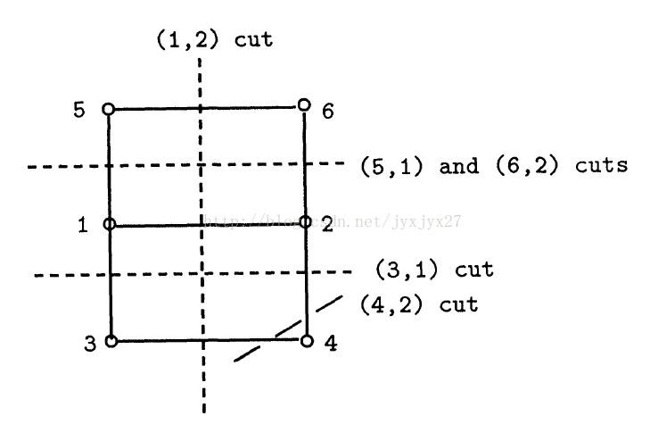
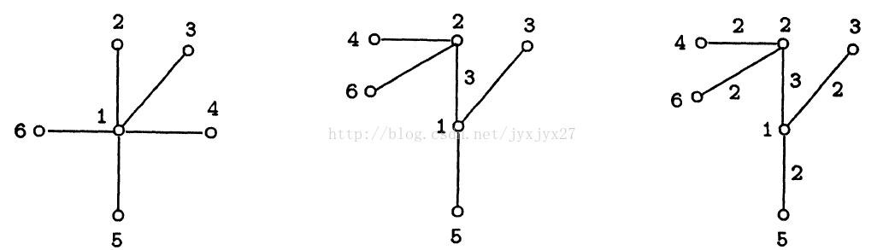

import { getPostUrl } from '@/utils/collection-paths';

## 注意！

* 在边很多的时候用邻接矩阵，边很少时要用前向星
* 从 `2` 开始循环！

::more

## 题目大意

给定一个无向图 $G=(V,E)$，多次询问两点之间的最小割。

## 朴素做法

对于每次询问，我们做一次最大流，复杂度 $O(Q\cdot \text{MaxflowTime})$，
$Q$ 太大的时候显然无法承受。

这时我们可以先预处理出所有点对的最大流，然后根据每个询问输出答案。

朴素预处理的复杂度 $O(n^2\cdot \text{MaxflowTime})$，
$n$ 太大的时候我们挂掉了！

## 提出问题

那么我们如何快速预处理出所有点对的最大流呢？
这就是这题所要考察的内容。

按照惯例，我们考虑问题要从简单入手，然后推到一般化。
注意图是无向的。

那图的简化是什么？没错，是**树**。

那么假设现在**有一颗无向树**，求所有点对的最大流用 LCA+RMQ 即可解决。
（例如：2857--TT 的身体）

那么对于图，我们理所当然想到要去构造一棵等价于原图的最大流树。

## 图

Gomory-Hutree 是一颗代表了所有源目节点对间的最小割的树。

求解出 Gomory-Hutree 就可以了解两两节点对之间的最大流
（最大流最小割定理）。

举例：一个有 $6$ 个节点的无向图，节点间的权重皆为 $1$，
节点间的最小割如下图所示：

**步骤一**：创建一棵星型树，节点 $1$ 为中心节点，
其他节点为叶子节点，如下图左侧所示。

**步骤二**：分别选编号为 $2$ 至 $6$ 的节点为源节点 $S$，
重复做步骤三和步骤四。

**步骤三**：在星型树中令与 $S$ 节点相邻的节点为目的节点 $T$，
计算 $S$ 与 $T$ 之间的最大流，并由此得到最小割。

将最大流标注在星型树中 $S$ 节点与 $T$ 节点间的链路上。

**步骤四**：对于每一个编号大于 $S$ 的节点 $i$，
如果在原图中 $S$ 与 $i$ 是邻居，且 $i$ 与 $S$ 在同一割集中，
则去除星型图中 $i$ 与 $T$ 的连接，增加 $i$ 与 $S$ 的连接，
如下图中间所示。

最后可得到如上图右侧所示的 Gomory-Hutree。

## 算法步骤

1. 首先任选一个点为根。设以结点 $1$ 为根，标记 $1$ 已经 check，
   把所有的结点都连到根 $1$。
2. 按顺序枚举未 check 的节点 $T$，比如以从小到大的顺序。
   - 设 $S$ 为此时结点 $T$ 的父亲，在原图中求 $S$-$T$ 的最大流
   - 从结点 $S$ 开始 DFS
   - 把在 $S$-$T$ 割中属于 $T$ 侧的未 check 结点设为 $T$ 结点的儿子；
     标记 $T$ 为 check
   - 重复直到所有的点都被 check。注意 $S$-$S$ 的最大流为 $0$

## 时间复杂度

由于 $1$ 事先被我 check 了，所以我们最后只要 check $|V|-1$ 次就可以了。

所以复杂度是 $O((|V|-1)\cdot \text{MaxflowTime})$。

预处理所有点对的最大流可以在更新树的同时一起更新，而无需最后再 LCA+RMQ。

## 模板题

* <a href={getPostUrl('solution-code2864', 'oi')}>[ZJOI2011]最小割</a>
* <a href={getPostUrl('solution-code4604', 'oi')}>[CQOI2016]不同的最小割</a>
