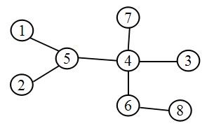

import PostLink from '@/components/PostLink.astro';

## 注意：

* 高精度！

::more

## 实现树的Prufer编码

Prufer 编码是用另外一种形式来描述一棵树，这棵树是无根树，
它可以和无根树之间形成一一对应关系。

已知树，如何求 Prufer 编码？

首先选这棵树叶子中编号最小的点，将这个点删除，
并且把它的邻接点加入一个数组中，例如第一个删除的节点为 $1$，
并且把 $5$ 加入数组中。

删除节点后形成一棵新的树，再在新树中删除最小的节点，
并且把邻接点加入数组中，这样重复以上步骤，
直到树中最后剩余两个点的时候终止操作。

这时候数组中的便是 Prufer 编码。



例如上图是一棵无根树，这棵树的 Prufer 编码为 $(5,5,4,4,4,6)$。

## 将 Prufer 编码还原为一棵树

假如 Prufer 编码为 $(a_1,a_2,a_3,\cdots a_{n-2})$ 在上述数组中，
在数组最后加入 $n$ 这个值，这样便形成了数组中包含 $n-1$ 个节点，
例如上述为 $(5,5,4,4,4,6,8)$。

然后取不在数组中的最小值为 $b_1$，则 $b_1$ 与 $a_1$ 是邻接点，
在数组中删除 $a_1$，再在剩下的数中选取不为 $b_1$，
且不在数组中的最小值为 $b_2$，则 $b_2$ 与 $a_2$ 是邻接点，
这样依次循环下去直到结束，这样便形成了一棵树。

## Prufer 编码的性质

**Cayley 定理**：不同的 $n$ 节点标号树的数量为 $n^{n-2}$。

任意一棵 $n$ 节点的树都可唯一的用长度为 $n-2$ 的 Prufer 编码表示。

度数为 $m$ 的节点的序号在 Prufer 编码中出现的次数为 $m-1$。

## 例题：[HNOI2008]明明的烦恼

### 题目描述

自从明明学了树的结构，就对奇怪的树产生了兴趣……
给出标号为 $1$ 到 $N$ 的点，以及某些点最终的度数，
允许在任意两点间连线，可产生多少棵度数满足要求的树？

### 输入格式

第一行为 $N(0\lt N\le 1000)$，接下来 $N$ 行，
第 $i+1$ 行给出第 $i$ 个节点的度数 $D_i$，
如果对度数不要求，则输入 `-1`。

### 输出格式

一个整数，表示不同的满足要求的树的个数，无解输出 `0`。

### 输入

```plain
3
1
-1
-1
```

### 输出

```plain
2
```

### 说明/提示

两棵树分别为 1-2-3; 1-3-2

### 题目分析

该题需要将树转化为 prufer 编码：

$n$ 为树的节点数，$d_i$ 为各节点的度数，$m$ 为无限制度数的节点数。

则有度数的点出现次数为：

$$\begin{split}tot=\sum_{i=1}^n (d_i-1)\end{split}$$

因为度数为 $d_i$ 的点出现了 $d_i-1$ 次。

所以要求在 $n-2$ 大小的数组中插入 $tot$ 个序号，
共有 $\begin{split}C_{n-2}^{tot}\end{split}$ 种插法。

在 $tot$ 个序号排列中，
插第一个节点的方法有 $\begin{split}C_{tot}^{d_1-1}\end{split}$ 种插法。

插第二个节点的方法有 $\begin{split}C_{tot}^{d_2-1}\end{split}$ 种插法。

……

另外还有 $m$ 个节点无度数限制，
所以它们可任意排列在剩余的 $n-2-tot$ 的空间中，
排列方法总数为 $\begin{split}m^{n-2-tot}\end{split}$。

根据乘法原理：

$$
\begin{split}
ans&=C_{n-2}^{tot}\cdot C_{tot}^{d_1-1}\cdot C_{tot-(d_1-1)}^{d_2-1}\cdots C_{d_n-1}^{d_n-1}\cdot m^{n-2-tot}\\
&=\frac{(n-2)!}{(n-2-tot)!\cdot tot!}\cdot \frac{tot!}{(d_1-1)!\cdot (tot-d_1+1)!}\cdots \frac{(d_n-1)!}{(d_n-1)!\cdot 0!}\cdot m^{n-2-tot}\\
&=\frac{(n-2)!\cdot m^{n-2-tot}}{(n-2-tot)!\cdot (d_1-1)!\cdot (d_2-1)!\cdots(d_n-1)!}
\end{split}
$$

然后就要高精度了……但高精度除法太麻烦了，
显而易见的排列组合一定是整数，所以可以进行质因数分解，
再做一下相加减。

关于 $n!$ 质因数分解有两种方法，第一种暴力分解，
这里着重讲第二种。

若 $p$ 为素数，则 $n!$ 可分解为一个数 $\times p^x$，其中

$$
\begin{split}
x=\left\lfloor\frac np\right\rfloor+\left\lfloor\frac n{p^2}\right\rfloor+\cdots+\left\lfloor\frac n{p^t}\right\rfloor
\end{split}
$$

且 $$\begin{split}p^t\lt n\end{split}$$
$$
\begin{split}
\therefore n!=p_1^{x_1}\cdot p_2^{x_2}\cdot p_3^{x_3}\cdots p_m^{x_m}\qquad(p_m\lt n)
\end{split}
$$

代码详见 <PostLink id="solution-code2425.mdx" collection="oi" text="Code" anchor="code"/>

## 模板题

* <PostLink id="solution-code2503.mdx" collection="oi" text="[HNOI2004]树的计数" />
* <PostLink id="solution-code1826.mdx" collection="oi" text="小猴打架" />
