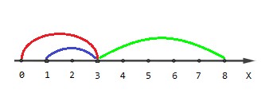
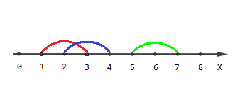

区间前缀和的经典问题，离散化后求前缀和（值即为覆盖的条数），
用离散化之前的值直接计算即可。

注意：

* 离散化后的值有 $2n$ 个，`sum` 数组和 `b` 数组要开 `n` 的两倍
* 只需要对 `L` 和 `R+1` 进行离散化就可以了，
  但记住取 `lower_bound` 的时候也要取 `R+1` 的排名，
  所以算前缀和的时候是 `--sum[y]` 而不是 `--sum[y+1]`
* 相邻两个端点的值不相同，在最后计算 `ans` 的时候只能算一边！

::more

:::center
## C. Covered Points Count
:::

::center[time limit per test\: 3 seconds]

::center[memory limit per test\: 256 megabytes]

::center[input\: standard input]

::center[output\: standard output]

You are given $n$ segments on a coordinate line;
each endpoint of every segment has integer coordinates.
Some segments can degenerate to points.
Segments can intersect with each other, be nested in each other or even coincide.

Your task is the following:
for every $k \in [1..n]$, calculate the number of points with integer coordinates
such that the number of segments that cover these points equals $k$.
A segment with endpoints $l_i$ and $r_i$ covers point $x$
if and only if $l_i \le x \le r_i$.

### Input

The first line of the input contains one integer $n$ ($1 \le n \le 2 \cdot 10^5$) —
the number of segments.

The next $n$ lines contain segments.
The $i$-th line contains a pair of integers $l_i, r_i$ ($0 \le l_i \le r_i \le 10^{18}$) —
the endpoints of the $i$-th segment.

### Output

Print $n$ space separated integers $cnt_1, cnt_2, \dots, cnt_n$,
where $cnt_i$ is equal to the number of points
such that the number of segments that cover these points equals to $i$.

### Examples
#### input
```plain
3
0 3
1 3
3 8
```
#### output
```plain
6 2 1 
```
#### input
```plain
3
1 3
2 4
5 7
```
#### output
```plain
5 2 0 
```

### Note

The picture describing the first example:



Points with coordinates $[0, 4, 5, 6, 7, 8]$ are covered by one segment,
points $[1, 2]$ are covered by two segments
and point $[3]$ is covered by three segments.

The picture describing the second example:



Points $[1, 4, 5, 6, 7]$ are covered by one segment,
points $[2, 3]$ are covered by two segments
and there are no points covered by three segments.

```cpp
#include <iostream>
#include <cstdio>
#include <cstring>
#include <algorithm>
using namespace std;
struct Node
{
	long long L,R;
}a[200005];
int sum[400005];
long long b[400005],ans[200005];
int main(void)
{
	int i,n,x,y,num=0;
	scanf("%d",&n);
	for(i=1;i<=n;++i)
	{
		scanf("%lld%lld",&a[i].L,&a[i].R);
		b[++num]=a[i].L;
		b[++num]=a[i].R+1;
	}
	sort(b+1,b+num+1);
	num=unique(b+1,b+num+1)-(b+1);
	for(i=1;i<=n;++i)
	{
		x=lower_bound(b+1,b+num+1,a[i].L)-b;
		y=lower_bound(b+1,b+num+1,a[i].R+1)-b;
		++sum[x];--sum[y];
	}
	for(i=1;i<=num;++i)sum[i]+=sum[i-1];
	for(i=1;i<num;++i)
	{
		ans[sum[i]]+=b[i+1]-b[i];
	}
	for(i=1;i<=n;++i)printf("%lld ",ans[i]);
	return 0;
}
```
