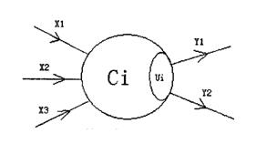
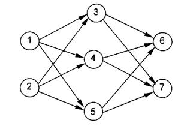

**一道~~语文题~~**

$c$ 的含义是兴奋度，只有大于 0 的时候才是兴奋状态。

$u$ 的含义是兴奋阀值，只有大于阀值才能传递剩余的兴奋状态。

注意输入模块的兴奋度要加上兴奋阀值。

::more

## Problem
### 问题背景

人工神经网络（Artificial Neural Network）是一种新兴的
具有自我学习能力的计算系统，
在模式识别、函数逼近及贷款风险评估等诸多领域有广泛的应用。

对神经网络的研究一直是当今的热门方向，
兰兰同学在自学了一本神经网络的入门书籍后，提出了一个简化模型，
他希望你能帮助他用程序检验这个神经网络模型的实用性。

### 问题描述

在兰兰的模型中，神经网络就是一张有向图，图中的节点称为神经元，
而且两个神经元之间至多有一条边相连，下图是一个神经元的例子：



神经元（编号为1）

图中，$X_1—X_3$是信息输入渠道，$Y_1－Y_2$是信息输出渠道，
$C_1$表示神经元目前的状态，$U_i$是阈值，可视为神经元的一个内在参数。

神经元按一定的顺序排列，构成整个神经网络。
在兰兰的模型之中，神经网络中的神经无分为几层；
称为输入层、输出层，和若干个中间层。
每层神经元只向下一层的神经元输出信息，只从上一层神经元接受信息。
下图是一个简单的三层神经网络的例子。



兰兰规定，$C_i$ 服从公式：$C_i=\sum\limits_{(j,i) \in E} W_{ji}C_j-U_i$（其中$n$是网络中所有神经元的数目）

公式中的$W_{ji}$（可能为负值）表示连接$j$号神经元和$i$号神经元的边的权值。
当 $C_i$ 大于$0$时，该神经元处于兴奋状态，否则就处于平静状态。
当神经元处于兴奋状态时，下一秒它会向其他神经元传送信号，信号的强度为 $C_i$。

如此，在输入层神经元被激发之后，
整个网络系统就在信息传输的推动下进行运作。

现在，给定一个神经网络，及当前输入层神经元的状态（$C_i$），
要求你的程序运算出最后网络输出层的状态。
### 输入格式

输入文件第一行是两个整数 $n(1\le n\le 20)$ 和 $p$。

接下来 $n$ 行，每行两个整数，第 $i＋1$ 行是神经元 $i$ 最初状态
和其阈值（$U_i$），非输入层的神经元开始时状态必然为 $0$。

再下面 $P$ 行，每行由两个整数 $i\ j$ 及一个整数 $W_{ij}$，
表示连接神经元 $i$、$j$ 的边权值为 $W_{ij}$。

### 输出格式

输出文件包含若干行，每行有两个整数，
分别对应一个神经元的编号，及其最后的状态，两个整数间以空格分隔。

仅输出最后状态非零的输出层神经元状态，并且按照编号由小到大顺序输出！

若输出层的神经元最后状态均为 $0$，则输出 `NULL`。
### 输入
```plain
5 6
1 0
1 0
0 1
0 1
0 1
1 3 1
1 4 1
1 5 1
2 3 1
2 4 1
2 5 1
```
### 输出
```plain
3 1
4 1
5 1
```
## Code
```cpp
#include <iostream>
#include <cstdio>
#include <cstring>
#include <algorithm>
#include <queue>
using namespace std;
struct Node
{
	int c,u;
}a[205];
struct Edge
{
	int to,next,v;
}e[40005];
int h[205],cnt;
bool vis[205];
inline void Addedge(int x,int y,int v)
{
	e[++cnt]=(Edge){y,h[x],v};h[x]=cnt;return;
}
queue<int>q;
inline void bfs()
{
	int i,x,y;
	while(!q.empty())
	{
		x=q.front();q.pop();
		a[x].c-=a[x].u;
		if(a[x].c<0)continue;
		for(i=h[x];i;i=e[i].next)
		{
			y=e[i].to;
			a[y].c+=a[x].c*e[i].v;
			if(!vis[y]){vis[y]=true;q.push(y);}
		}
	}
	return;
}
int main(void)
{
	int i,x,y,v,n,m;
	bool ans=false;
	scanf("%d%d",&n,&m);
	for(i=1;i<=n;++i)
	{
		scanf("%d%d",&a[i].c,&a[i].u);
		if(a[i].c)
		{
			vis[i]=true;
			a[i].c+=a[i].u;
			q.push(i);
		}
	}
	for(i=1;i<=m;++i)
	{
		scanf("%d%d%d",&x,&y,&v);
		Addedge(x,y,v);
	}
	bfs();
	for(i=1;i<=n;++i)
	{
		if(!h[i]&&a[i].c>0)
		{
			ans=true;
			printf("%d %d\n",i,a[i].c);
		}
	}
	if(!ans)printf("NULL\n");
	return 0;
}
```
