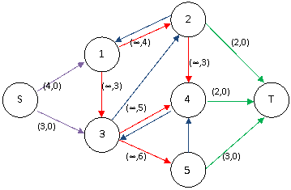
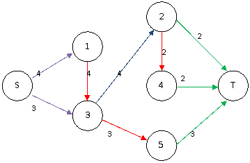

转载自[byvoid](https://www.byvoid.com/zhs/blog/noi-2008-employee)

这道题正确的解法是构造网络，
求网络最小费用最大流，
但是模型隐藏得较深，不易想到。

构造网络是该题的关键，
以下面一个例子说明构图的方法和解释。

::more

例如一共需要 4 天，
四天需要的人数依次是 `4, 2, 5, 3`。
有 5 类志愿者，如下表所示：

| 种类	 | 1	   | 2	   | 3	   | 4	   | 5	   |
|-----|------|------|------|------|------|
| 时间	 | 1-2	 | 1-1	 | 2-3	 | 3-3	 | 3-4	 |
| 费用	 | 3	   | 4	   | 3	   | 5	   | 6	   |

设雇佣第 $i$ 类志愿者的人数为 $X_i$，
每个志愿者的费用为 $V_i$，
第 $j$ 天雇佣的人数为 $P_j$，
则每天的雇佣人数应满足一个不等式，
如上表所述，可以列出
$$
\begin{cases}
P_1 = X_1 + X_2 \le 4\\
P_2 = X_1 + X_3 \le 2\\
P_3 = X_3 + X_4 +X_5 \le 5\\
P_4 = X_5 \le 3
\end{cases}
$$
对于第 $i$ 个不等式，
添加辅助变量 $Y_i (Y_i \le 0)$，
可以使其变为等式
$$
\begin{cases}
P_1 = X_1 + X_2 - Y_1 = 4\\
P_2 = X_1 + X_3 - Y_2 = 2\\
P_3 = X_3 + X_4 +X_5 - Y_3 = 5\\
P_4 = X_5 - Y_4 = 3
\end{cases}
$$
在上述四个等式上下添加 $P_0 = 0, P_5 = 0$，
每次用下边的式子减去上边的式子，得出
$$
\begin{cases}
P_1 - P_0 = X_1 + X_2 - Y_1 = 4\\
P_2 - P_1 = X_3 - X_2 -Y_2 +Y_1 = -2\\
P_3 - P_2 = X_4 + X_5 - X_1 - Y_3 + Y_2 =3\\
P_4 - P_3 = - X_3 - X_4 + Y_3 - Y_4 = -2\\
P_5 - P_4 = - X_5 + Y_4 = -3
\end{cases}
$$
观察发现，每个变量都在两个式子中出现了，
而且一次为正，一次为负。
所有等式右边和为 $0$。

接下来，根据上面五个等式构图。

每个等式为图中一个顶点，
添加源点 $S$ 和汇点 $T$。

如果一个等式右边为非负整数 $c$，
从源点 $S$ 向该等式对应的顶点连接一条容量为 $c$、
权值为 $0$ 的有向边；
如果一个等式右边为负整数 $c$，
从该等式对应的顶点向汇点 $T$ 连接一条容量为 $c$、
权值为 $0$ 的有向边。

如果一个变量 $X_i$ 在第 $j$ 个等式中出现为 $X_i$，
在第 $k$ 个等式中出现为 $-X_i$，
从顶点 $j$ 向顶点 $k$ 连接一条容量为 $\infty$、
权值为 $V_i$ 的有向边。

如果一个变量 $Y_i$ 在第 $j$ 个等式中出现为 $Y_i$，
在第 $k$ 个等式中出现为 $-Y_i$，
从顶点 $j$ 向顶点 $k$ 连接一条容量为 $\infty$、
权值为 $0$ 的有向边。

构图以后，
求从源点 $S$ 到汇点 $T$ 的最小费用最大流，
费用值就是结果。

根据上面的例子可以构造出如下网络，
红色的边为每个变量 $X$ 代表的边，
蓝色的边为每个变量 $Y$ 代表的边，
边的容量和权值已经标出
（蓝色没有标记，因为都是容量 $\infty$、权值 $0$）。


在这个图中求最小费用最大流，
流量网络如下图，
每个红色边的流量就是对应的变量 $X$ 的值。



所以，答案为 $4 \times 3 + 2 \times 3 + 3 \times 6 = 36$。

上面的方法很神奇地求出了结果，
思考为什么这样构图。
我们将最后的五个等式进一步变形，
得出以下结果
$$
\begin{cases}
- X_1 - X_2 + Y_1 + 4 = 0\\
- X_3 + X_2 + Y_2 - Y_1 - 2 = 0\\
- X_4 - X_5 + X_1 + Y_3 - Y_2 + 3 = 0\\
X_3 + X_4 - Y_3 + Y_4 - 2 = 0\\
X_5 - Y_4 - 3 = 0
\end{cases}
$$
可以发现，每个等式左边都是几个变量和一个常数相加减，
右边都为 $0$，
恰好就像网络流中除了源点和汇点的顶点都满足**流量平衡**。

每个正的变量相当于流入该顶点的流量，
负的变量相当于流出该顶点的流量，
而正常数可以看作来自附加源点的流量，
负的常数是流向附加汇点的流量。

因此可以据此构造网络，
求出从附加源到附加汇的网络最大流，
即可满足所有等式。
而我们还要求 $\sum_{i = 1}^M X_i \cdot V_i$ 最小，
所以要在 $X$ 变量相对应的边上加上权值，
然后求**最小费用最大流**。

然而在 `NOI` 的现场上，
该题得分的平均分 $12.56$，
只有高逸涵大牛拿到了满分。

不能不说这是一道难题，
难就难在抽象出问题的数学模型，设计有效的算法。
而信息学竞赛正朝着这个方向发展，
数学建模将是解决问题的共同关键步骤。

## Problem

### Description

申奥成功后，布布经过不懈努力，
终于成为奥组委下属公司人力资源部门的主管。

布布刚上任就遇到了一个难题：
为即将启动的奥运新项目招募一批短期志愿者。

经过估算，这个项目需要 $N$ 天才能完成，
其中第 $i$ 天至少需要 $A_i$ 个人。

布布通过了解得知，一共有 $M$ 类志愿者可以招募。
其中第 $i$ 类可以从第 $S_i$ 天工作到第 $T_i$ 天，
招募费用是每人 $C_i$ 元。

新官上任三把火，为了出色地完成自己的工作，
布布希望用尽量少的费用招募足够的志愿者，
但这并不是他的特长！

于是布布找到了你，
希望你帮他设计一种最优的招募方案。

### Input

第一行包含两个整数 $N$, $M$，
表示完成项目的天数和可以招募的志愿者的种类。

接下来的一行中包含 $N$ 个非负整数，
表示每天至少需要的志愿者人数。

接下来的 $M$ 行中每行包含三个整数 $S_i$, $T_i$, $C_i$，
含义如上文所述。

为了方便起见，我们可以认为每类志愿者的数量都是无限多的。

### Output

仅包含一个整数，表示你所设计的最优方案的总费用。
### Sample Input

```plain
3 3
2 3 4
1 2 2
2 3 5
3 3 2
```

### Sample Output

```plain
14
```

### Hint

$1 \le N \le 1000$，$1 \le M \le 10000$，
题目中其他所涉及的数据均不超过 $2^{31} - 1$。

## Code
```cpp
#include <iostream>
#include <cstdio>
#include <cstring>
#include <algorithm>
#include <queue>
#define inf 0x3F3F3F3F
using namespace std;
struct Node
{
	int to,next,v,c;
}e[100005];
int S,T,ans,a[1005],h[1005],d[1005],pre[1005],cnt=1;
bool vis[1005];
inline void Addedge(int x,int y,int v,int c)
{
	e[++cnt]=(Node){y,h[x],v,c};h[x]=cnt;
	e[++cnt]=(Node){x,h[y],0,-c};h[y]=cnt;
	return;
}
inline bool SPFA()
{
	int i,x,y;
	queue<int>q;q.push(S);
	memset(d,0x3F,sizeof(d));d[S]=0;
	while(!q.empty())
	{
		x=q.front();q.pop();
		vis[x]=false;
		for(i=h[x];i;i=e[i].next)
		{
			y=e[i].to;
			if(e[i].v&&d[y]>d[x]+e[i].c)
			{
				d[y]=d[x]+e[i].c;
				pre[y]=i;
				if(!vis[y]){q.push(y);vis[y]=true;}
			}
		}
	}
	return d[T]<inf;
}
inline void Adjust()
{
	int i,j=T,delta=inf;
	while(pre[j])
	{
		i=pre[j];
		if(e[i].v<delta)delta=e[i].v;
		j=e[i^1].to;
	}
	ans+=delta*d[T];j=T;
	while(pre[j])
	{
		i=pre[j];
		e[i].v-=delta;
		e[i^1].v+=delta;
		j=e[i^1].to;
	}
	return;
}
int main(void)
{
	int i,x,y,v,n,m;
	scanf("%d%d",&n,&m);
	for(i=1;i<=n;++i)scanf("%d",&a[i]);
	for(i=1;i<=m;++i)
	{
		scanf("%d%d%d",&x,&y,&v);
		Addedge(x,y+1,inf,v);
	}
	S=n+2;T=n+3;
	for(i=1;i<=n+1;++i)
	{
		v=a[i]-a[i-1];
		if(v>=0)Addedge(S,i,v,0);
		else Addedge(i,T,-v,0);
	}
	for(i=1;i<=n;++i)Addedge(i+1,i,inf,0);
	while(SPFA())Adjust();
	printf("%d\n",ans);
	return 0;
}
```
