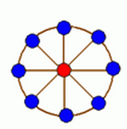
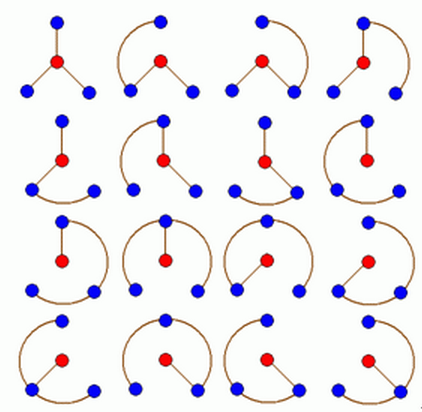

import bakupLink from './solution-code2422/bakup.png?url';

由于内容过长、公式较多，
暂时将内容隐藏，
请公式恐惧症们做好心理准备。

::more

## Problem

### Description

轮状病毒有很多变种，
所有轮状病毒的变种都是从一个轮状基产生的。

一个 $N$ 轮状基由圆环上 $N$ 个不同的基原子和圆心处一个核原子构成的，
$2$ 个原子之间的边表示这 $2$ 个原子之间的信息通道。

如下图所示



$N$ 轮状病毒的产生规律是在一个 $N$ 轮状基中删去若干条边，
使得各原子之间有唯一的信息通道，
例如共有 $16$ 个不同的 $3$ 轮状病毒，
如下图所示：



现给定 $N (N\ \le 100)$，
编程计算有多少个不同的 $N$ 轮状病毒

### Input

第一行有 $1$ 个正整数 $N$

### Output

计算出的不同的 $N$ 轮状病毒数输出

### Sample Input

```plain
3
```

### Sample Output

```plain
16
```

## 法一: 行列式

转载自 [vfleaking](http://vfleaking.blog.163.com/blog/static/17480763420119685112649/)，
<a href={bakupLink}>题解备份</a>

对于新手还是建议去看看基尔霍夫矩阵，
这一篇[论文](https://wenku.baidu.com/view/0c086741be1e650e52ea990e.html)挺不错的。

用基尔霍夫矩阵使用高斯消元解行列式，
时间复杂度 $O(n^3)$ 似乎可以 `AC`。

首先行列式有很多性质：

* 第 $a$ 行 $\times k$ 加到第 $b$ 行上去，行列式的值不变
* 三角行列式的值等于对角线元素之积
* 第 $a$ 行与第 $b$ 行互换，行列式的值取反
* 常数 $\times$ 行列式，可以把常数乘到某一行里去

如果你行列式不是很熟，建议先搜搜行列式～
不然下面会看晕～

其实如果你仔细观察矩阵，可以发现它是这样的：（消去了病毒中央）
$$
\begin{vmatrix}
3	&-1	&0	&0	&\cdots	&0	&0	&0	&-1\\
-1	&3	&-1	&0	&\cdots	&0	&0	&0	&0\\
0	&-1	&3	&-1	&\cdots	&0	&0	&0	&0\\
0	&0	&-1	&3	&\cdots	&0	&0	&0	&0\\
0	&0	&0	&-1	&\cdots	&0	&0	&0	&0\\
\vdots	&\vdots	&\vdots	&\vdots	&\ddots	&\vdots	&\vdots	&\vdots	&\vdots\\
0	&0	&0	&0	&\cdots	&3	&-1	&0	&0\\
0	&0	&0	&0	&\cdots	&-1	&3	&-1	&0\\
0	&0	&0	&0	&\cdots	&0	&-1	&3	&-1\\
-1	&0	&0	&0	&\cdots	&0	&0 	&-1	&3
\end{vmatrix}
$$
那么我们现在对行列式进行变换，我们把第 $1$ 行与第 $2$ 行交换，再把第 $2$ 行与第 $3$ 行交换……，再把第 $n-1$ 行与第 $n$ 行变换，得到新的行列式：
$$
\begin{vmatrix}
-1	&3	&-1	&0	&\cdots	&0	&0	&0	&0\\
0	&-1	&3	&-1	&\cdots	&0	&0	&0	&0\\
0	&0	&-1	&3	&\cdots	&0	&0	&0	&0\\
0	&0	&0	&-1	&\cdots	&0	&0	&0	&0\\
\vdots	&\vdots	&\vdots	&\vdots	&\ddots	&\vdots	&\vdots	&\vdots	&\vdots\\
0	&0	&0	&0	&\cdots	&3	&-1	&0	&0\\
0	&0	&0	&0	&\cdots	&-1	&3	&-1	&0\\
0	&0	&0	&0	&\cdots	&0	&-1	&3	&-1\\
-1	&0	&0	&0	&\cdots	&0	&0 	&-1	&3\\
3	&-1	&0	&0	&\cdots	&0	&0	&0	&-1
\end{vmatrix}
$$
这个行列式跟一开始的那个行列式的值不一定相等。
因为我们是通过 $n-1$ 次交换行的操作得到的，
为了说话方便我们称一开始的行列式为 $A$，上面刚写的行列式为 $B$
那么由行列式性质得：$A=(-1)^{n-1}\cdot B$
现在就可以正大光明地处理 $B$ 了～

利用行列式性质，来手算这个行列式。之所以刚才有那么一步，就是为了方便手算。
因为观察 $B$ 矩阵，发现就只剩下左下角的 $-1$、$3$、$-1$ 三个倒霉了。


$$
\begin{matrix}
\text{倒数第二行：}		&-1	&0	&0	&0	&\cdots	&0	&0 	&-1	&3\\
\text{用第一行的：}		&-1	&3	&-1	&0	&\cdots	&0	&0	&0	&0\\
\text{乘以}-1\text{ 来消：}	&0	&-3	&1	&0	&\cdots	&0	&0 	&-1	&3\\
\text{再用第二行：}		&0	&-1	&3	&-1	&\cdots	&0	&0	&0	&0\\
\text{乘以}-3\text{ 来消：}	&0	&0	&-8	&3	&\cdots	&0	&0 	&-1	&3
\end{matrix}
$$

这样就有了初步感觉了～

现在把这个过程一般化：

$$
\begin{matrix}
\text{第 }k\text{ 个和第 }k+1\text{ 个：}	&0	&0	&\cdots	&F(k)	&G(k)	&0	&0	&\cdots	&-1	&3\\
\text{总能找到上面的某一行}			&0	&0	&\cdots	&-1\quad	&3~~~	&-1	&0	&\cdots	&0	&0\\
\text{乘以 }F(k)\text{ 来消：}			&0	&0	&\cdots	&0	&F(k+1)	&G(k+1)	&0	&\cdots	&-1	&3\\
\end{matrix}
$$

于是得到：

$$
\begin{cases}
F(k+1)=G(k)+3F(k)\\
G(k+1)=-F(k)
\end{cases}
$$

整合一下：$F(k+1)=3F(k)-F(k-1)$

从初始的行和消了一次之后的行中取得边界条件：$F(1)=-1,F(2)=-3$
最终一定会变为下面这种情况：
$$
\begin{matrix}
\text{倒数第二行：}			&0	&0	&0	&0	&\cdots	&F(n-3)	&G(n-3)	&-1	&3\\
\text{用倒数第四行：}			&0	&0	&0	&0	&\cdots	&-1	&3	&-1	&0\\
\text{乘以 }F(n - 3)\text{ 来消：}	&0	&0	&0	&0	&\cdots	&0	&F(n-2)	&G(n-2)-1	&3\\
\text{用倒数第三行：}			&0	&0	&0	&0	&\cdots	&0	&-1	&3	&-1\\
\text{乘以 }F(n - 2)\text{ 来消：}	&0	&0	&0	&0	&\cdots	&0	&0	&F(n-1)-1	&G(n-1)+3
\end{matrix}
$$

好现在搞定了倒数第二行，来看看成果：
$(f = F(n - 1) - 1, g = G(n - 1) + 3)$
$$
\begin{vmatrix}
-1	&3	&-1	&0	&\cdots	&0	&0	&0	&0\\
0	&-1	&3	&-1	&\cdots	&0	&0	&0	&0\\
0	&0	&-1	&3	&\cdots	&0	&0	&0	&0\\
0	&0	&0	&-1	&\cdots	&0	&0	&0	&0\\
\vdots	&\vdots	&\vdots	&\vdots	&\ddots	&\vdots	&\vdots	&\vdots	&\vdots\\
0	&0	&0	&0	&\cdots	&3	&-1	&0	&0\\
0	&0	&0	&0	&\cdots	&-1	&3	&-1	&0\\
0	&0	&0	&0	&\cdots	&0	&-1	&3	&-1\\
0	&0	&0	&0	&\cdots	&0	&0 	&f	&g\\
3	&-1	&0	&0	&\cdots	&0	&0	&0	&-1
\end{vmatrix}
$$
好，现在来搞倒数第一行。
和倒数第二行的方法是类似的。

再设函数 $H(k)$ 和 $I(k)$，
意义与 $F(k)$、$G(k)$ 类似，得：
$$
\begin{cases}
H(k+1)=I(k)+3H(k)\\
I(k+1)=-H(k)
\end{cases}
$$
其实跟 $F$、$G$的递推式是一样的我会乱说？
$$H(k+1)=3H(k)-H(k-1)$$
边界条件是：$H(1)=3,H(2)=8$
最后使劲搞一搞，倒数第一行就成了：
$$
\begin{matrix}
0	&0	&0	&0	&0	&\cdots	&0	&0	&H(n - 1)	&I(n - 1)-1
\end{matrix}
$$

再来看成果：$(h = H(n - 1), i = I(n - 1) - 1)$
$$
\begin{vmatrix}
-1	&3	&-1	&0	&\cdots	&0	&0	&0	&0\\
0	&-1	&3	&-1	&\cdots	&0	&0	&0	&0\\
0	&0	&-1	&3	&\cdots	&0	&0	&0	&0\\
0	&0	&0	&-1	&\cdots	&0	&0	&0	&0\\
\vdots	&\vdots	&\vdots	&\vdots	&\ddots	&\vdots	&\vdots	&\vdots	&\vdots\\
0	&0	&0	&0	&\cdots	&3	&-1	&0	&0\\
0	&0	&0	&0	&\cdots	&-1	&3	&-1	&0\\
0	&0	&0	&0	&\cdots	&0	&-1	&3	&-1\\
0	&0	&0	&0	&\cdots	&0	&0 	&f	&g\\
0	&0	&0	&0	&\cdots	&0	&0	&h	&i
\end{vmatrix}
$$
用倒数第二行来消倒数第一行，得：
$$
\begin{matrix}
0	&0	&0	&0	&\cdots	&0	&0	&0	&i-g\cdot ( \frac hf )
\end{matrix}
$$
现在这个行列式已经是三角行列式了，它的值就是对角线元素之积。
于是：$$B =(-1)\times (-1)\times (-1)\times \cdots\times f(i-g\cdot \frac hf )$$
一共有 $n - 2$ 个 $-1$。

如前文所述：$$A = (-1)^{n - 1} B$$

又因为：$$B = (-1)^{n - 2} (f \cdot i - g \cdot h)$$

于是有：$$A = (-1)^{2n - 3} (f \cdot i - g \cdot h) = -f \cdot i + g \cdot h$$

带入 $f$、$g$、$h$、$i$ 的值得：
$$A = -(F(n - 1) - 1)(I(n - 1) - 1) + (G(n - 1) + 3) H(n - 1)$$

带入 $H$、$I$ 的值：
$$A = -(F(n - 1) - 1)(-H(n - 2) - 1) + (-F(n - 2) + 3) H(n - 1)$$

然后再展开……回忆下 $F$、$H$ 的递推式
$$
\begin{align*}
A&=F(n-1)H(n-2)+F(n-1)-H(n-2)-1-F(n-2)H(n-1)+3H(n-1)\\
&=H(n)+F(n-1)+F(n-1)H(n-2)-F(n-2)H(n-1)-1\\
&=H(n)+F(n-1)+\begin{vmatrix}F(n-1) &H(n-1)\\F(n-2) &H(n-2)\end{vmatrix}-1
\end{align*}
$$
发现不能化简了？
没关系！在行列式上动动手脚吧！

### FH 定理
对于任意大于 $2$ 的 $k$ 有：
$$
\begin{vmatrix}
F(k-1) &H(k-1)\\
F(k-2) &H(k-2)
\end{vmatrix}=\begin{vmatrix}
F(2) &H(2)\\
F(1) &H(1)
\end{vmatrix}
$$

**证明**：
对于行列式：
$$
\begin{vmatrix}
F(k-1) &H(k-1)\\
F(k-2) &H(k - 2)
\end{vmatrix}
$$

把行列式最下面的行取反，则行列式的值取反：
$$
-\begin{vmatrix}
F(k-1) &H(k-1)\\
-F(k-2) &-H(k-2)
\end{vmatrix}
$$
把行列式的上面的行乘以 $3$ 加到下面去：
$$
-\begin{vmatrix}
F(k-1) &H(k-1)\\
3F(k-1)-F(k-2) &3H(k-1)-H(k-2)
\end{vmatrix}
$$
特意构造的递推式出现了：
$$
-\begin{vmatrix}
F(k-1) &H(k-1)\\
F(k) &H(k)
\end{vmatrix}
$$
有点眉目了~ 把第一行与第二行调换位置，行列式的值取反：
$$
\begin{vmatrix}
F(k) &H(k)\\
F(k-1) &H(k-1)
\end{vmatrix}
$$
一目了然，这是 `k++` 后的行列式的样子。
（**Pascal 同学早日转 C++**）

那么立即推出：
$$
\begin{vmatrix}
F(k-1) &H(k-1)\\
F(k-2) &H(k-2)
\end{vmatrix}=\begin{vmatrix}
F(2) &H(2)\\
F(1) &H(1)
\end{vmatrix}
$$

FH 定理得证。

利用 FH 定理，
把 $F(1) = -1, F(2) = -3, H(1) = 3, H(2) = 8$ 带入：
$$
\begin{vmatrix}
F(n-1) &H(n-1)\\
F(n-2) &H(n-2)
\end{vmatrix} = -1
$$

于是就爽了嘛！
$$
\begin{align*}
\therefore A&=H(n)+F(n-1)+(-1)-1\\
&=H(n)+F(n-1)-2
\end{align*}
$$
进一步我们发现……设
$$R(n)=H(n)+F(n-1)-2$$

那么立即有：
$$
\begin{align*}
R(n)&=3H(n-1)-H(n-2)+3F(n-2)-F(n-3)-2\\
&= 3(R(n-1)+2)-(R(n-2)+2)-2\\
&= 3R(n-1)-R(n-2)+2
\end{align*}
$$

所以，轮状病毒的方案数满足递推式
$F(n) = 3F(n - 1) - F(n - 2) + 2$，其中 $F(1) = 1, F(2) = 5$。

然后随手写一个高精度就可以过了～


## 法二：DP

转载自 [boshi](https://www.luogu.org/blog/boshi/solution-p2144)

如果用 `f[x]` 表示加入了 $x$ 个周围的点后的方案数，
我们首先想到的递推式是：
$$f[i] = \sum_{j = 1}^i f[i - j] \cdot j$$

解释：最后加入的 $j$ 个点每个都可能与中心点连边，
将所有方案数累加即可。

但是，第一个点永远不会与第 $n$ 个点连边，
因此方案数统计并不准确。

我们再设：
$$g[i] = \sum_{j = 2}^i f[i - j] \cdot j \cdot (j - 1)$$

解释：如果有 $j$ 个周围的点连成一条，
且跨越了 $1$ 和 $n$，
我们将所有这样的情况累加到答案中去。
如果这样的点有 $j$ 个，
剩下的点肯定不与这 $j$ 个点相连，
所以连边方案数就是 $f[i - j]$，
这 $j$ 个点有 $(j - 1)$ 种选法（跨越 $1$ 和 $n$），
与中心点连边的方案数是 $j$，
根据乘法原理，答案要累加 $f[i - j] \cdot j \cdot (j - 1)$。

这样的 $f[n] + g[n]$ 就是我们要求的轮状病毒的数量。

下面我们思考如何快速求出 $f$ 和 $g$。
### 多阶差分

首先分析 $f[i]$。
如果我们可以求出所有 $f[i - j] \cdot j$ 的前缀和，
这个问题就变得非常方便了。

问题是对于不同的 $i$，
这个前缀和中每一项都会发生变化。

那如果我们知道了变化的量是多少呢？
于是我们就对前缀和进行差分。
$$
\begin{align*}
\Delta f[i]&=\sum_{j=1}^i f[i-j]\cdot j - \sum_{j=1}^{i-1} f[i-1-j]\cdot j\\
&=\sum_{j=0}^i f[i-j]\cdot j - \sum_{j=0}^{i-1} f[i-1-j]\cdot j\qquad (f[i]\cdot 0=f[i-1]\cdot 0=0)\\
&=\sum_{j=0}^i f[j]\cdot (i-j) - \sum_{j=0}^{i-1} f[j]\cdot (i-1-j)\qquad (\text{交换枚举顺序})\\
&=\sum_{j=0}^i f[i]\\
g[i]&=\sum_{j=2}^i f[i-j]\cdot j \cdot (j-1)\\
&=\sum_{j=0}^i f[i-j]\cdot j \cdot (j-1)\qquad(f[i-1]\cdot 1\cdot 0=0)\\
\Delta g[i]&=\sum_{j=0}^i f[i-j]\cdot j \cdot (j-1)-\sum_{j=0}^{i-1} f[i-j-1]\cdot (j-1) \cdot (j-2)\\
&=\sum_{j=0}^i f[j]\cdot (i-j)\cdot (i-j+1)-\sum_{j=0}^{i-1} f[j]\cdot (i-j)\cdot (i-j-1)\\
&=\sum_{j=0}^i f[j]\cdot (i-j)\cdot 2\qquad(i-i=0)\\
\Delta^2 g[i]&= \sum_{j=0}^i f[j]\cdot (i-j)\cdot 2-\sum_{j=0}^{i-1} f[j]\cdot (i-j-1)\cdot 2\\
&=\sum_{j=0}^i 2f[j]\qquad(i-i=0)\\
\therefore \Delta^3 &=2f[i]
\end{align*}
$$
我们维护 $f[i]$ 的前缀和，以及 $f[i - j] \cdot j$ 的前缀和，
每次将 $f[i]$ 累加进 $f[i]$ 的前缀和，
将 $f[i]$ 的前缀和累加进 $f[i - j] \cdot j$ 的前缀和，
$g[i]$ 同理。

::more


## 行列式解法：
```cpp
#include <iostream>
#include <cstdio>
#include <cstring>
#include <algorithm>
#define digit 100000000
using namespace std;
struct bigint
{
	mutable int a[205];
	inline bigint()
	{
		memset(a,0,sizeof(a));
		a[0]=1;a[1]=0;return;
	}
	inline bigint(int b)
	{
		memset(a,0,sizeof(a));
		a[0]=1;a[1]=b;return;
	}
	inline int& operator[](size_t pos)const{return a[pos];}
	inline bigint operator+(int b)const
	{
		int i;bigint c=*this;
		c[1]+=b;
		for(i=1;i<=c[0];++i)
		{
			if(c[i]>=digit)
			{
				++c[i+1];c[i]-=digit;
			}
		}
		if(c[c[0]+1])++c[0];
		return c;
	}
	inline bigint operator-(const bigint& b)const
	{
		int i;bigint c;c[0]=a[0];
		for(i=1;i<=c[0];++i)c[i]=a[i]-b[i];
		for(i=1;i<=c[0];++i)
		{
			if(c[i]<0)
			{
				c[i]+=digit;--c[i+1];
			}
		}
		while(!c[c[0]]&&c[0]>1)--c[0];
		return c;
	}
	inline bigint operator*(int b)const
	{
		int i;bigint c;c[0]=a[0];
		for(i=1;i<=c[0];++i)c[i]=a[i]*b;
		for(i=1;i<=c[0]||c[i];++i)
		{
			if(c[i]>=digit)
			{
				c[i+1]+=c[i]/digit;c[i]%=digit;
			}
		}
		c[0]=i-1;
		return c;
	}
	friend ostream& operator<<(ostream& os,const bigint& a)
	{
		printf("%d",a[a[0]]);
		for(int i=a[0]-1;i>=1;--i)printf("%08d",a[i]);
		return os;
	}
}f[3005];
int main(void)
{
	int i,n;
	scanf("%d",&n);
	f[1]=1;f[2]=5;
	for(i=3;i<=n;++i)f[i]=f[i-1]*3-f[i-2]+2;
	cout<<f[n]<<endl;
	return 0;
}
```

## DP解法：
```cpp
#include <iostream>
#include <cstdio>
#include <cstring>
#include <algorithm>
#define digit 1000000000
using namespace std;
struct bigint
{
	mutable int a[205];
	inline bigint()
	{
		memset(a,0,sizeof(a));
		a[0]=1;a[1]=0;return;
	}
	inline bigint(int b)
	{
		memset(a,0,sizeof(a));
		a[0]=1;a[1]=b;return;
	}
	inline int& operator[](size_t pos)const{return a[pos];}
	inline bigint& operator+=(const bigint& b)
	{
		int i;a[0]=max(a[0],b[0]);
		for(i=1;i<=a[0];++i)a[i]+=b[i];
		for(i=1;i<=a[0];++i)
		{
			if(a[i]>=digit)
			{
				++a[i+1];a[i]-=digit;
			}
		}
		if(a[a[0]+1])++a[0];
		return *this;
	}
	friend ostream& operator<<(ostream& os,const bigint& a)
	{
		printf("%d",a[a[0]]);
		for(int i=a[0]-1;i>=1;--i)printf("%09d",a[i]);
		return os;
	}
}F=1,F1=1,F2=1,G=0,G1=0,G2=0;
int main(void)
{
	int i,n;
	scanf("%d",&n);
	for(i=1;i<=n;++i)
	{
		if(i)G2+=F,G2+=F;
		if(i<n)G1+=G2,G+=G1;
		F=F1;F2+=F;F1+=F2;
	}
	cout<<(F+=G)<<endl;
	return 0;
}
```
完结撒花！★,°:.☆(￣▽￣)/$:.°★
