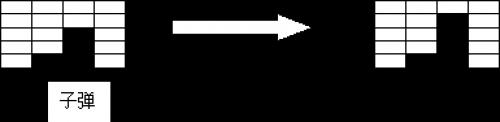

注意：子弹没有的时候不能打有奖励的砖块，
打有奖励的砖块可以抽象成借子弹。

`w1[i][j]` 代表在能借子弹的情况下，
第 $i$ 列用了 $j$ 颗子弹能够达到的最高分数，
`w2` 代表不能借子弹的最高分数。

`f1[i][j]` 代表能借子弹的情况下，
从左往右打了 $i$ 列用了 $j$ 颗子弹能够达到的最高分数，
`f2` 代表不借子弹的最高分数。

::more

## Problem

### 题目描述

小红很喜欢玩一个叫打砖块的游戏，
这个游戏的规则如下：

在刚开始的时候，
有 $n$ 行 $\times$ $m$ 列的砖块，
小红有 $k$ 发子弹。

小红每次可以用一发子弹，
打碎某一列当前处于这一列最下面的那块砖，
并且得到相应的得分。（如图所示）



某些砖块在打碎以后，
还可能得到一发子弹的奖励。

最后当所有的砖块都打碎了，
或者小红没有子弹了，游戏结束。

小红在游戏开始之前，
就已经知道每一块砖在打碎以后的得分，
并且知道能不能得到一发奖励的子弹。

小红想知道在这次游戏中她可能的最大得分，
可是这个问题对于她来说太难了，
你能帮帮她吗？

### 输入格式

第一行有 $3$ 个正整数，$n$, $m$, $k$。
表示开始的时候，
有 $n$ 行 $\times$ $m$ 列的砖块，
小红有 $k$ 发子弹。

接下来有 $n$ 行，每行的格式如下：
$f_1\ c_1\ f_2\ c_2\ f_3\ c_3\ \cdots f_m\ c_m$

其中 $f_i$ 为正整数，表示这一行的第 $i$ 列的砖，在打碎以后的得分。

$c_i$ 为一个字符，只有两种可能，$Y$ 或者 $N$。
$Y$ 表示有一发奖励的子弹，$N$ 表示没有。

所有的数与字符之间用一个空格隔开，行末没有多余的空格。

### 输出格式

仅一个正整数，表示最大的得分。

### 输入

```plain
3 4 2
9 N 5 N 1 N 8 N
5 N 5 Y 5 N 5 N
6 N 2 N 4 N 3 N
```

### 输出

```plain
13
```

### 说明/提示

对于 $20\%$ 的数据，
满足 $1 \le n, m \le 5$，$1 \le k \le 10$，
所有的字符 $c$ 都为 `N`。

对于 $50\%$ 的数据，
满足 $1 \le n, m \le 200$，$1 \le k \le 200$，
所有的字符 $c$ 都为 `N`。

对于 $100\%$ 的数据，
满足 $1 \le n, m \le 200$，$1 \le k \le 200$，
字符 $c$ 可能为 `Y`。

对于 $100\%$ 的数据，
所有的 $f$ 值满足 $1 \le f \le 10000$。

## Code
```cpp
#include <iostream>
#include <cstdio>
#include <cstring>
#include <algorithm>
using namespace std;
int a[205][205],w1[205][205],w2[205][205];
int f1[205][205],f2[205][205];
bool re[205][205];
int main(void)
{
	int i,j,l,n,m,k,ch,cnt;
	scanf("%d%d%d",&n,&m,&k);
	for(i=1;i<=n;++i)
	{
		for(j=1;j<=m;++j)
		{
			scanf("%d",&a[i][j]);
			while(ch=getchar())if(ch=='Y'||ch=='N')break;
			re[i][j]=ch=='Y';
		}
	}
	for(j=1;j<=m;++j)
	{
		cnt=n;
		while(cnt&&re[cnt][j])
		{
			w1[j][0]+=a[cnt][j];--cnt;
		}
		for(i=1;i<=n&&cnt;++i)//打i发子弹
		{
			w1[j][i]=w2[j][i]=w1[j][i-1]+a[cnt][j];
			--cnt;
			while(cnt&&re[cnt][j])
			{
				w1[j][i]+=a[cnt][j];--cnt;
			}
		}
	}
	for(i=1;i<=m;++i)//列
	{
		for(j=0;j<=k;++j)//子弹
		{
			for(l=0;l<=j;++l)//当前列使用的子弹数
			{
				f1[i][j]=max(f1[i][j],f1[i-1][j-l]+w1[i][l]);
				if(l<j)f2[i][j]=max(f2[i][j],f2[i-1][j-l]+w1[i][l]);
				if(l)f2[i][j]=max(f2[i][j],f1[i-1][j-l]+w2[i][l]);
			}
		}
	}
	printf("%d\n",f2[m][k]);
	return 0;
}
```
